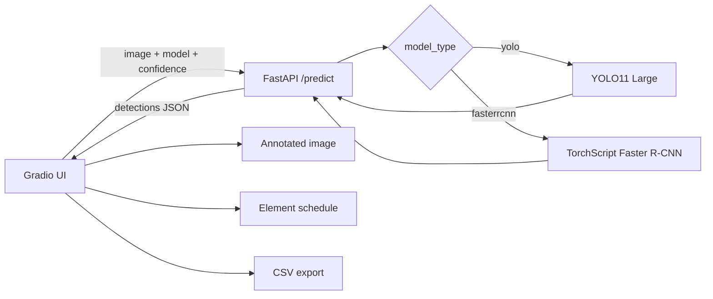

# planparser

Object detection для архитектурных планов: Gradio-демо, FastAPI-сервис инференса и две обученные модели: **YOLO11 Large** и **Faster R-CNN ResNet-50 FPN**.

[](#)
[](#)
[](#)
[](#)
[](#)
[](https://huggingface.co/spaces/Ann-Grabetski/planparser)

[English README](README_EN.md)


## Демо

[Открыть приложение на Hugging Face Spaces](https://huggingface.co/spaces/Ann-Grabetski/planparser)

Приложение принимает изображение плана и возвращает разметку с bounding boxes, ведомость элементов, raw JSON, время обработки и CSV-файл для скачивания.

[Видео-разбор на YouTube](https://youtu.be/v34W_xNp6WU)

## Результаты обучения


| Модель | Настройка обучения | Результат на validation |
| --- | --- | --- |
| YOLO11 Large | Ultralytics 8.3.249, PyTorch 2.8, Tesla T4, image size 640, batch 16, AdamW. Stage A: 30 эпох, `freeze=10`, `lr0=0.003`; Stage B: 120 эпох, `freeze=0`, `lr0=0.001`. | `P=0.901`, `R=0.898`, `mAP50=0.937`, `mAP50-95=0.736` на 207 validation images / 4,824 objects. Inference: 19.8 ms на изображение на T4. |
| Faster R-CNN ResNet-50 FPN | Torchvision Faster R-CNN с ImageNet-pretrained ResNet-50 FPN, custom anchors, 25 эпох, batch 16, AdamW `lr=3e-4`, `weight_decay=3e-4`, cosine LR schedule, Albumentations augmentation. | Лучший залогированный результат около 24-й эпохи: `P=0.84`, `R=0.87`, `mAP50=0.728`, `mAP50-95=0.497`. Модель экспортирована в TorchScript. |

YOLO11 выбрана основной моделью для демо: она дала более высокий mAP и более быстрый inference при простой схеме сервинга.

## Датасет

Проект использует [Floorplan details Fork](https://universe.roboflow.com/research-g8szb/floorplan-details-fork/dataset/1), лицензия **CC BY 4.0**.

| Метрика | Значение |
| --- | ---: |
| Изображения | 1,033 |
| Train / validation / test | 722 / 207 / 104 |
| Классы объектов | 15 |
| Bounding boxes | 24,996 |

Классы: `bathtub`, `bed`, `bed2`, `chair`, `door`, `door2`, `shower`, `sink`, `sofa1`, `sofa2`, `sofa3`, `stove`, `table`, `toilet`, `vanity`.


## Архитектура



## Локальный запуск

```bash
git clone https://github.com/anngrrr/planparser.git
cd planparser
uv sync
```

Создать `.env`:

```env
API_URL="http://127.0.0.1:8000"
MODEL_DIR="src/models"
MODEL_1="yolo11l_custom.pt"
MODEL_2="fasterrcnn_resnet50.pt"
EXAMPLES_DIR="src/examples"
```

Запустить API и UI в разных терминалах:

```bash
uv run uvicorn planparser.api:app --host 0.0.0.0 --port 8000
```

```bash
uv run python planparser/app.py
```

Открыть `http://127.0.0.1:7860`. Документация API доступна на `http://127.0.0.1:8000/docs`.

## Ноутбуки

- `notebooks/04_finetune_yolo11l.ipynb` - двухстадийный fine-tuning YOLO11 и validation.
- `notebooks/05_train-fasterrcnn-resnet50.ipynb` - обучение Faster R-CNN, validation и экспорт в TorchScript.

Ultralytics YOLO распространяется по лицензии **AGPL-3.0**. Лицензия проекта: см. [LICENSE](LICENSE).
