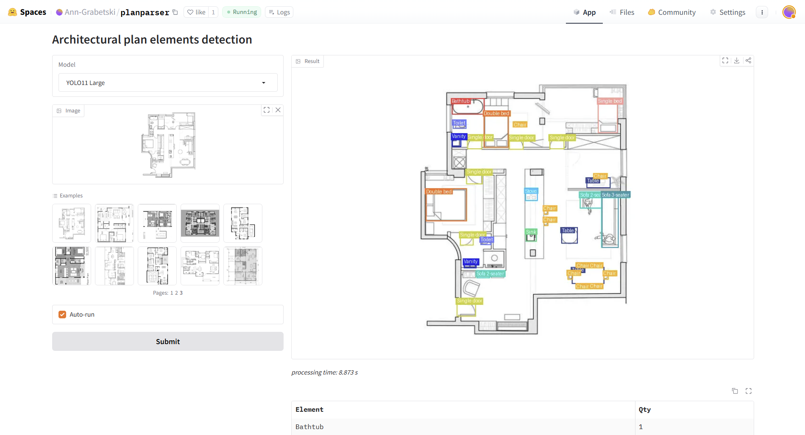
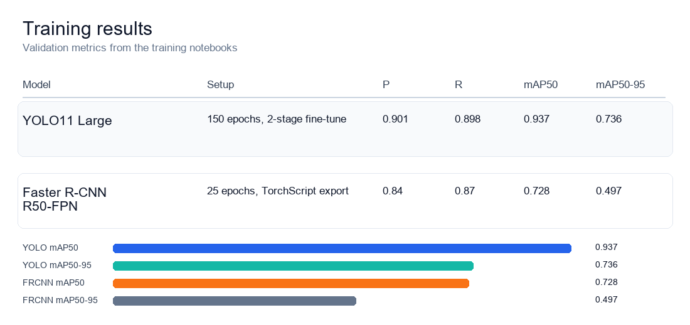
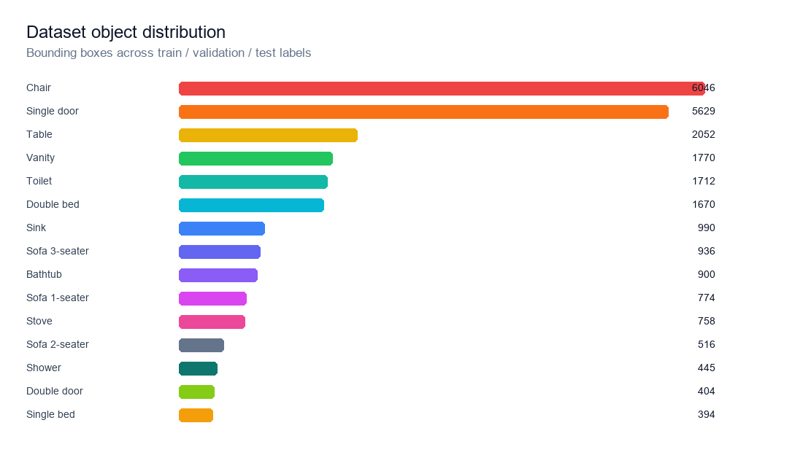
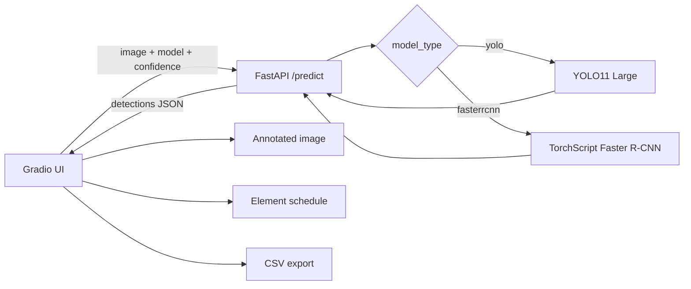

# planparser

Floor plan object detection with a Gradio demo, FastAPI inference service, and two trained detectors: **YOLO11 Large** and **Faster R-CNN ResNet-50 FPN**.

[](#)
[](#)
[](#)
[](#)
[](#)
[](https://huggingface.co/spaces/Ann-Grabetski/planparser)

[Russian README](README.md)



## Demo

[Open the live app on Hugging Face Spaces](https://huggingface.co/spaces/Ann-Grabetski/planparser)

The app takes a floor plan image and returns an annotated image, an element schedule, raw detection JSON, processing time, and a downloadable CSV.

[YouTube walkthrough](https://youtu.be/v34W_xNp6WU)

## Training Results



| Model | Training setup | Validation result |
| --- | --- | --- |
| YOLO11 Large | Ultralytics 8.3.249, PyTorch 2.8, Tesla T4, image size 640, batch 16, AdamW. Stage A: 30 epochs, `freeze=10`, `lr0=0.003`; Stage B: 120 epochs, `freeze=0`, `lr0=0.001`. | `P=0.901`, `R=0.898`, `mAP50=0.937`, `mAP50-95=0.736` on 207 validation images / 4,824 objects. Inference: 19.8 ms per image on T4. |
| Faster R-CNN ResNet-50 FPN | Torchvision Faster R-CNN with ImageNet-pretrained ResNet-50 FPN, custom anchors, 25 epochs, batch 16, AdamW `lr=3e-4`, `weight_decay=3e-4`, cosine LR schedule, Albumentations augmentation. | Best logged validation around epoch 24: `P=0.84`, `R=0.87`, `mAP50=0.728`, `mAP50-95=0.497`. Exported to TorchScript. |

YOLO11 was selected as the main demo model because it gave substantially higher mAP and faster inference while keeping the inference API simple.

## Dataset

The project uses [Floorplan details Fork](https://universe.roboflow.com/research-g8szb/floorplan-details-fork/dataset/1), licensed under **CC BY 4.0**.

| Metric | Value |
| --- | ---: |
| Images | 1,033 |
| Train / validation / test | 722 / 207 / 104 |
| Object classes | 15 |
| Bounding boxes | 24,996 |

Classes: `bathtub`, `bed`, `bed2`, `chair`, `door`, `door2`, `shower`, `sink`, `sofa1`, `sofa2`, `sofa3`, `stove`, `table`, `toilet`, `vanity`.



## Architecture



## Run Locally

```bash
git clone https://github.com/anngrrr/planparser.git
cd planparser
uv sync
```

Create `.env`:

```env
API_URL="http://127.0.0.1:8000"
MODEL_DIR="src/models"
MODEL_1="yolo11l_custom.pt"
MODEL_2="fasterrcnn_resnet50.pt"
EXAMPLES_DIR="src/examples"
```

Start the API and UI in separate terminals:

```bash
uv run uvicorn planparser.api:app --host 0.0.0.0 --port 8000
```

```bash
uv run python planparser/app.py
```

Open `http://127.0.0.1:7860`. API docs are available at `http://127.0.0.1:8000/docs`.

## Notebooks

- `notebooks/04_finetune_yolo11l.ipynb` - two-stage YOLO11 fine-tuning and validation.
- `notebooks/05_train-fasterrcnn-resnet50.ipynb` - Faster R-CNN training, validation, and TorchScript export.

Ultralytics YOLO is distributed under **AGPL-3.0**. Project license: see [LICENSE](LICENSE).
